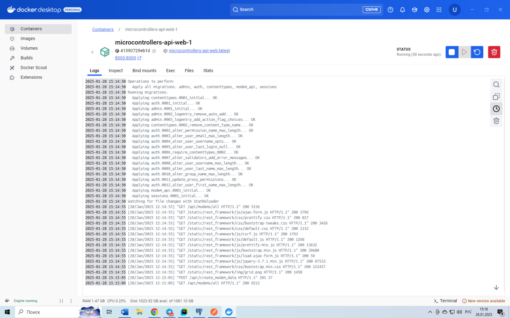
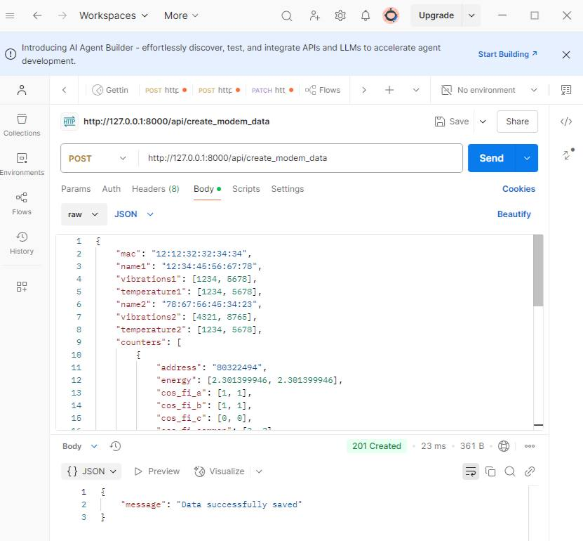
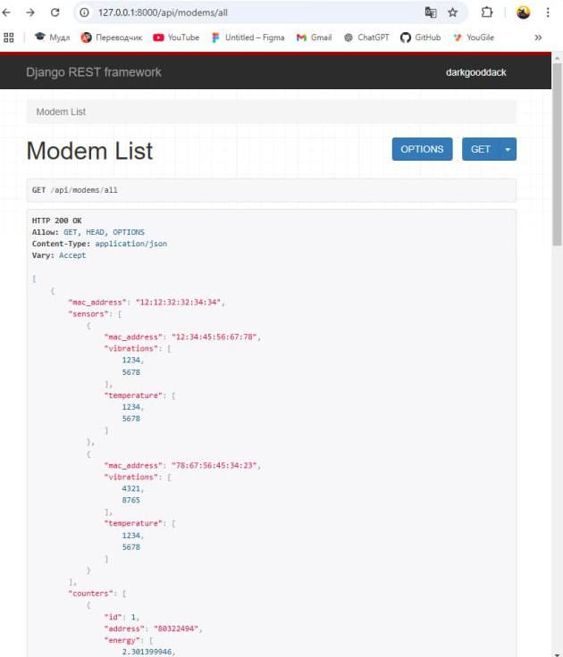
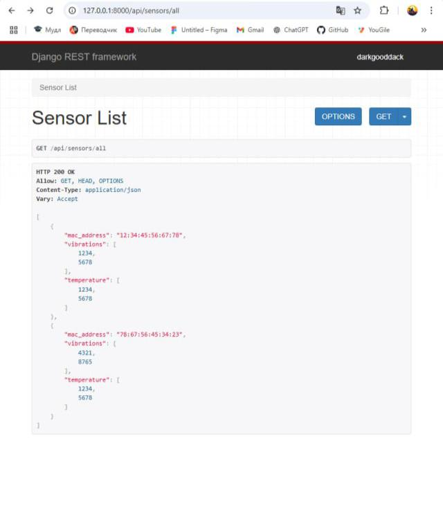
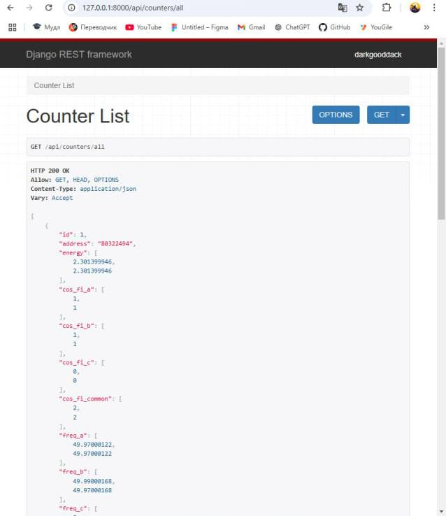

# microcontrollers-api
API для взаимодействия с базой данных, в которой хранится информация о модемах, датчиках и счётчиках. 

## Инструкция по запуску проекта
### 1. Клонировать репозиторий
Сначала необходимо клонировать репозиторий проекта на свою локальную машину. Откройте терминал (или PowerShell в Windows) и выполните команду:
```
git clone https://github.com/darkgooddack/microcontrollers-api.git
```
Перейдите в папку проекта:
```
cd microcontrollers-api
```
### 2. Создание .env файла

Создайте .env на примере .env.example в папке microcontrollers-api и в папке на 1 уровень ниже modem_project, настройте параметры для работы с базой данных.
### 3. Установка зависимостей
Для начала необходимо установить все зависимости, используемые в проекте.
Создайте и активируйте виртуальное окружение:

На Windows:
```
python -m venv .venv
.\.venv\Scripts\activate
```
На macOS/Linux:
```
python3 -m venv .venv
source .venv/bin/activate
```
Установите зависимости проекта:
Внутри виртуального окружения выполните команду:
```
pip install -r requirements.txt
```
*Примечение: для систем Linux (Docker контейнеров) использовать 
psycopg2-binary==2.9.10 в других случаях psycopg2==2.9.10*

### 4. Запуск Docker контейнеров

Убедитесь, что у вас установлен Docker и Docker Compose. 
Запустите контейнеры из microcontrollers-api:
```
docker-compose up --build
```
Эта команда создаст и запустит все контейнеры, включая базу данных и веб-сервер.
При запуске контейнера автоматически применяться миграции.



### 5. Проверка работы проекта

Через Postman можно провести POST запрос по адресу
```
http://localhost:8000/api/create_modem_data
```
В body необходимо выбрать вкладку raw и вставить json.



Откройте браузер и перейдите по следующему адресу:
```
http://localhost:8000/api/modems/all
```

```
http://localhost:8000/api/sensors/all
```

```
http://localhost:8000/api/counters/all
```
